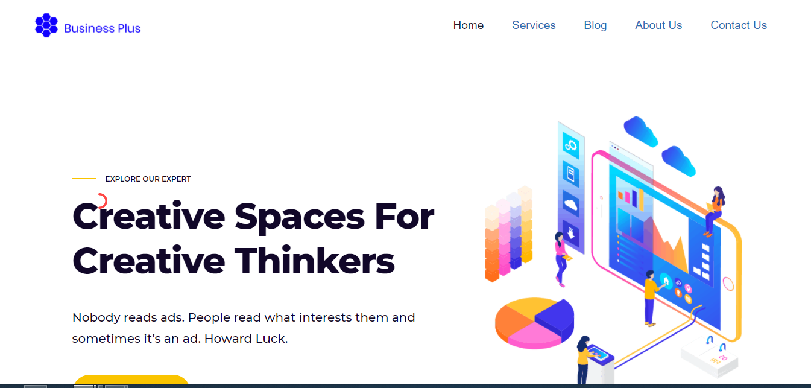

## Introduction

Business Route is a showcase web site is a website used to present the products and services offered by a company or small business to the customer, reinforcing the perception of the brand.

## Informations

 - Status: Finished
 - Lastest version: 1.0 
 - Sector: showcase web site
 - Created: December 2020 
 - Last updated: December 2020

## Table of contents
* [Documentation](#general-info)
* [Demo](#demo)
* [Screenshots](#screenshots)
* [Technologies](#technologies)
* [Setup](#setup)
* [Features](#features)
* [Status](#status)
* [Contact](#contact)
* [License](#license)

## Documentation
Please read the documentation

## Demo
[http://businessplus.byethost32.com/ ](http://businessplus.byethost32.com/)

## Screenshots

## Technologies
* Wordpress

## Setup

## Features

## Status
Project is: _ finished_ 

## Contact
contact@delta-dev-software.com

## License
<a href="license.txt">MIT License</a>